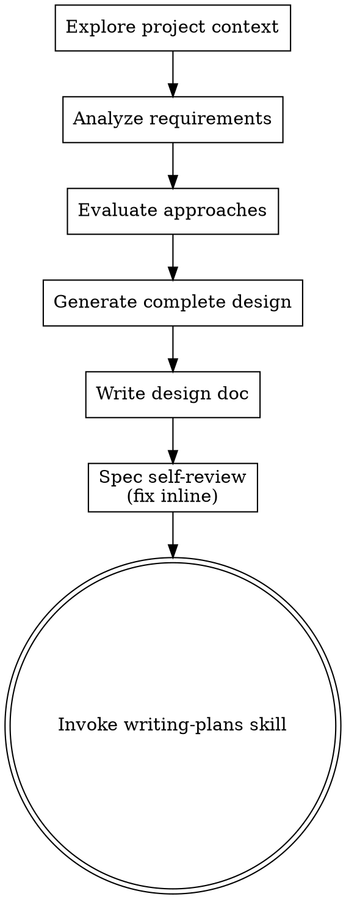

# Brainstorming Ideas Into Designs

Turn ideas into fully formed designs and specs through single-pass analysis with self-review.

Start by understanding the current project context and the task requirements. Analyze constraints, explore approaches, then generate a complete design. Self-review via subagent before proceeding.

<HARD-GATE>
Do NOT invoke any implementation skill, write any code, scaffold any project, or take any implementation action until you have generated a design and it has passed spec review.
</HARD-GATE>

## Anti-Pattern: "This Is Too Simple To Need A Design"

Every project goes through this process. A todo list, a single-function utility, a config change — all of them. "Simple" projects are where unexamined assumptions cause the most wasted work. The design can be short (a few sentences for truly simple projects), but you MUST generate one.

## Checklist

You MUST create a task for each of these items and complete them in order:

1. **Explore project context** — check files, docs, recent commits
2. **Analyze requirements** — identify purpose, constraints, success criteria from the task description and codebase
3. **Evaluate 2-3 approaches** — with trade-offs, select the best one with reasoning
4. **Generate design** — complete design covering architecture, components, data flow, error handling, testing
5. **Write design doc** — save to `docs/superpowers/specs/YYYY-MM-DD-<topic>-design.md` and commit
6. **Spec self-review** — quick inline check for placeholders, contradictions, ambiguity, scope (see below)
7. **Transition to implementation** — invoke writing-plans skill to create implementation plan

## Process Flow

**The terminal state is invoking writing-plans.** Do NOT invoke frontend-design, mcp-builder, or any other implementation skill. The ONLY skill you invoke after brainstorming is writing-plans.

## The Process

**Understanding the task:**

- Check out the current project state first (files, docs, recent commits)
- Assess scope: if the request describes multiple independent subsystems, decompose into sub-projects first. Each sub-project gets its own spec → plan → implementation cycle.
- Identify purpose, constraints, and success criteria from the task description, codebase context, and any referenced docs
- If requirements are ambiguous and no safe default exists, use the escalation skill

**Exploring approaches:**

- Evaluate 2-3 different approaches with trade-offs
- Select the best approach with clear reasoning
- Lead with the recommended option and explain why

**Generating the design:**

- Generate a complete design in a single pass
- Scale each section to its complexity: a few sentences if straightforward, up to 200-300 words if nuanced
- Cover: architecture, components, data flow, error handling, testing

**Design for isolation and clarity:**

- Break the system into smaller units that each have one clear purpose, communicate through well-defined interfaces, and can be understood and tested independently
- For each unit, you should be able to answer: what does it do, how do you use it, and what does it depend on?
- Can someone understand what a unit does without reading its internals? Can you change the internals without breaking consumers? If not, the boundaries need work.
- Smaller, well-bounded units are also easier for you to work with - you reason better about code you can hold in context at once, and your edits are more reliable when files are focused. When a file grows large, that's often a signal that it's doing too much.

**Working in existing codebases:**

- Explore the current structure before proposing changes. Follow existing patterns.
- Where existing code has problems that affect the work (e.g., a file that's grown too large, unclear boundaries, tangled responsibilities), include targeted improvements as part of the design - the way a good developer improves code they're working in.
- Don't propose unrelated refactoring. Stay focused on what serves the current goal.

## After the Design

**Documentation:**

- Write the validated design (spec) to `docs/superpowers/specs/YYYY-MM-DD-<topic>-design.md`
  - (User preferences for spec location override this default)
- Use elements-of-style:writing-clearly-and-concisely skill if available
- Commit the design document to git

**Spec Self-Review:**
After writing the spec document, look at it with fresh eyes:

1. **Placeholder scan:** Any "TBD", "TODO", incomplete sections, or vague requirements? Fix them.
2. **Internal consistency:** Do any sections contradict each other? Does the architecture match the feature descriptions?
3. **Scope check:** Is this focused enough for a single implementation plan, or does it need decomposition?
4. **Ambiguity check:** Could any requirement be interpreted two different ways? If so, pick one and make it explicit.

Fix any issues inline. No need to re-review — just fix and move on.

**Implementation:**

- Invoke the writing-plans skill to create a detailed implementation plan
- Do NOT invoke any other skill. writing-plans is the next step.

## Key Principles

- **YAGNI ruthlessly** - Remove unnecessary features from all designs
- **Explore alternatives** - Always evaluate 2-3 approaches before settling
- **Self-review** - Use spec-document-reviewer subagent to validate design quality
- **Escalate ambiguity** - If requirements are unclear and no safe default exists, escalate rather than guess
