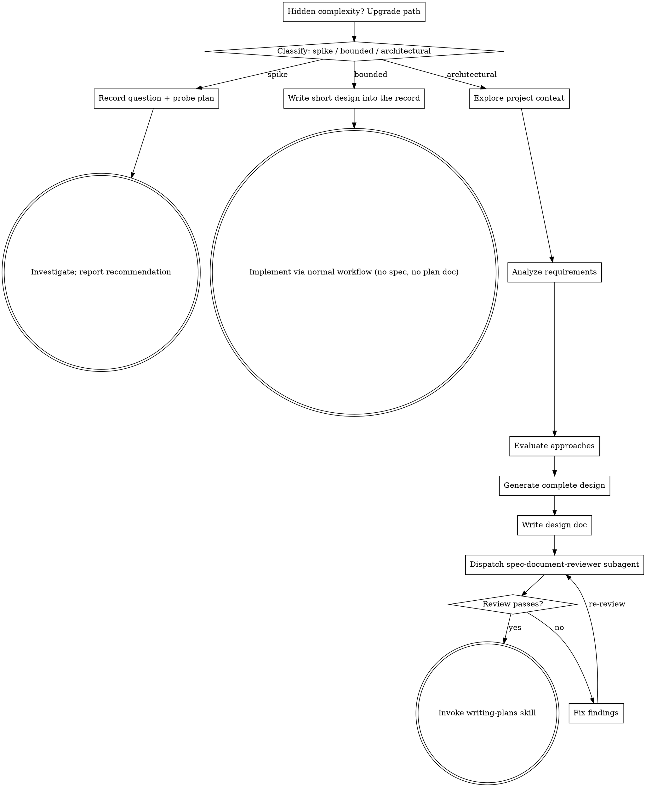

# Brainstorming Ideas Into Designs

Turn ideas into fully formed designs and specs through single-pass analysis with self-review.

Start by classifying how much process the request needs, then work through
your path: understand the context, analyze the requirements, generate a
design, and put it through that path's gate.

<HARD-GATE>
Do NOT invoke any implementation skill, write any code, scaffold any
project, or take any implementation action until you have generated a
design and it has passed its path's gate. This applies to EVERY task on
EVERY path below — the ceremony scales with the task; the gate never does.
</HARD-GATE>

## Three Paths

Before you analyze anything, classify the request and **write the
classification down** with the one fact that decided it — "bounded: the
auth middleware this changes is already in `src/auth/`" — at the top of
whatever record this run produces. Nobody is here to override a
misclassification, so it has to be auditable after the fact:

- **Spike** — a feasibility question ("can we...", "is it possible...",
  "quick and dirty is fine") whose output is an answer, not code you
  keep. Record the question and what you'll try in 2-3 sentences, then
  find out as cheaply as correctness allows. No design doc, no spec file,
  no spec review. Report findings as a recommendation; anything you built
  stays labeled throwaway and does not get merged.
- **Bounded** — a well-scoped change to code that already exists in this
  repo: a new flag, a small endpoint, a one-file fix. Understanding the
  kind of app is not enough — bounded means the flow you are changing is
  already here to read. If there is no existing flow to change, the task
  is not bounded. Analyze the requirements that matter, write a short
  design (a few sentences to a few short paragraphs) into the run's
  record, and implement it through the normal development workflow — TDD
  applies, and the task review is the gate. No spec file, no spec-review
  subagent, no implementation plan document.
- **Architectural** — new projects, new subsystems, changes that
  restructure how components fit together or alter interfaces others
  depend on. Follow the full process: requirements, approaches, sectioned
  design, written spec, spec review via subagent, then the writing-plans
  skill.

When in doubt between two paths, take the heavier one — and unattended,
doubt is cheaper to resolve upward than it looks, because the lighter
path's mistakes surface only after the work is done. The ratchet is
one-way: hidden complexity discovered mid-task upgrades the path — say
so in the record and step up. Nothing downgrades mid-task.

## Anti-Pattern: "Too Simple To Need A Design"

Every path ends with a design that something other than your own
confidence has checked. A todo list, a single-function utility, a config
change — the design may be two sentences, but you MUST generate one and
run it through the path's gate. "Simple" tasks are where unexamined
assumptions cause the most wasted work. What scales with simplicity is
the artifact, never the gate.

## Red Flags

| Thought | Reality |
|---------|---------|
| "This is too simple to need a design" | Simple means a short design, not no design. Two sentences, then the path's gate. |
| "I'll call it bounded and skip the spec" | Reaching for a label to skip work IS the doubt — take the heavier path. |
| "It's bounded, so the task review will catch anything I got wrong" | The task review checks the code against the design. It cannot catch a design nobody wrote down. |
| "I understand this kind of app, so it's bounded" | Bounded measures the repo, not your familiarity. A new project has no existing flow — it is architectural. |
| "The spike works, so I'll keep the code" | A spike's output is an answer. Keeping the code is a new request — classify it. |
| "It grew, but I'm almost done — no need to re-classify" | Hidden complexity upgrades the path mid-task. Record the upgrade and step up. |
| "No human is watching, so the classification is just bookkeeping" | It is the only record of why this task got the process it got. Write it down. |

## Checklist

Classify first, record the path, then create a task for each item on your
path and complete them in order.

**Spike:**
1. **Explore project context** — enough to frame the probe
2. **Record question + probe plan** — 2-3 sentences
3. **Investigate** — as cheaply as correctness allows
4. **Report findings** — a recommendation; label anything built as throwaway

**Bounded:**
1. **Explore project context** — check files, docs, recent commits
2. **Analyze requirements** — purpose, constraints, success criteria
3. **Write a short design into the run's record** — approach, files touched, testing
4. **Implement** — proceed with the normal development workflow (TDD applies); no spec file, no plan document

**Architectural:**
1. **Explore project context** — check files, docs, recent commits
2. **Analyze requirements** — identify purpose, constraints, success criteria from the task description and codebase
3. **Evaluate 2-3 approaches** — with trade-offs, select the best one with reasoning
4. **Generate design** — complete design covering architecture, components, data flow, error handling, testing
5. **Write design doc** — save to `docs/superpowers/specs/YYYY-MM-DD-<topic>-design.md` and commit
6. **Spec review via subagent** — dispatch the spec-document-reviewer subagent (see below); fix any findings and re-review until it passes
7. **Transition to implementation** — invoke writing-plans skill to create implementation plan

## Process Flow

```dot
digraph brainstorming {
    "Classify: spike / bounded / architectural" [shape=diamond];
    "Record question + probe plan" [shape=box];
    "Investigate; report recommendation" [shape=doublecircle];
    "Write short design into the record" [shape=box];
    "Implement via normal workflow (no spec, no plan doc)" [shape=doublecircle];
    "Explore project context" [shape=box];
    "Analyze requirements" [shape=box];
    "Evaluate approaches" [shape=box];
    "Generate complete design" [shape=box];
    "Write design doc" [shape=box];
    "Dispatch spec-document-reviewer subagent" [shape=box];
    "Review passes?" [shape=diamond];
    "Fix findings" [shape=box];
    "Invoke writing-plans skill" [shape=doublecircle];
    "Hidden complexity? Upgrade path" [shape=box];

    "Classify: spike / bounded / architectural" -> "Record question + probe plan" [label="spike"];
    "Classify: spike / bounded / architectural" -> "Write short design into the record" [label="bounded"];
    "Classify: spike / bounded / architectural" -> "Explore project context" [label="architectural"];
    "Record question + probe plan" -> "Investigate; report recommendation";
    "Write short design into the record" -> "Implement via normal workflow (no spec, no plan doc)";
    "Hidden complexity? Upgrade path" -> "Classify: spike / bounded / architectural";

    "Explore project context" -> "Analyze requirements";
    "Analyze requirements" -> "Evaluate approaches";
    "Evaluate approaches" -> "Generate complete design";
    "Generate complete design" -> "Write design doc";
    "Write design doc" -> "Dispatch spec-document-reviewer subagent";
    "Dispatch spec-document-reviewer subagent" -> "Review passes?";
    "Review passes?" -> "Fix findings" [label="no"];
    "Fix findings" -> "Dispatch spec-document-reviewer subagent" [label="re-review"];
    "Review passes?" -> "Invoke writing-plans skill" [label="yes"];
}
```

**Terminal states are path-bound.** Architectural: the ONLY skill you
invoke after brainstorming is writing-plans — never frontend-design,
mcp-builder, or any other implementation skill. Bounded: after the short
design is recorded, implementation proceeds directly through the normal
development workflow. Spike: the terminal state is a reported
recommendation.

## The Process

The subsections below serve the bounded and architectural paths (a spike
stops at "record the probe, run it"). Sections from **Exploring
approaches** onward are architectural-path depth — for bounded work,
context plus requirements plus a short recorded design is the whole
process.

**Understanding the task:**

- Check out the current project state first (files, docs, recent commits)
- Assess scope: if the request describes multiple independent subsystems, decompose into sub-projects first. Each sub-project gets its own spec → plan → implementation cycle.
- Identify purpose, constraints, and success criteria from the task description, codebase context, and any referenced docs
- If requirements are ambiguous and no safe default exists, use the escalation skill

**Exploring approaches:**

- Evaluate 2-3 different approaches with trade-offs
- Select the best approach with clear reasoning
- Lead with the recommended option and explain why
- YAGNI ruthlessly - remove unnecessary features from every approach and design

**Generating the design:**

- Generate a complete design in a single pass
- Scale each section to its complexity: a few sentences if straightforward, up to 200-300 words if nuanced
- Cover: architecture, components, data flow, error handling, testing

**Design for isolation and clarity:**

- Break the system into smaller units that each have one clear purpose, communicate through well-defined interfaces, and can be understood and tested independently
- For each unit, you should be able to answer: what does it do, how do you use it, and what does it depend on?
- Can someone understand what a unit does without reading its internals? Can you change the internals without breaking consumers? If not, the boundaries need work.
- Smaller, well-bounded units are also easier for you to work with - you reason better about code you can hold in context at once, and your edits are more reliable when files are focused. When a file grows large, that's often a signal that it's doing too much.

**Working in existing codebases:**

- Explore the current structure before proposing changes. Follow existing patterns.
- Where existing code has problems that affect the work (e.g., a file that's grown too large, unclear boundaries, tangled responsibilities), include targeted improvements as part of the design - the way a good developer improves code they're working in.
- Don't propose unrelated refactoring. Stay focused on what serves the current goal.

## After the Design (architectural path)

**Documentation:**

- Write the validated design (spec) to `docs/superpowers/specs/YYYY-MM-DD-<topic>-design.md`
  - (User preferences for spec location override this default)
- Use elements-of-style:writing-clearly-and-concisely skill if available
- Commit the design document to git

**Spec Review (via subagent):**
After writing and committing the spec document, dispatch the spec-document-reviewer
subagent to validate it — this is the autonomous quality gate that replaces a
human spec review. Use the template in `spec-document-reviewer-prompt.md`, passing
the spec file path. The reviewer checks:

1. **Completeness:** placeholders, "TBD"/"TODO", incomplete sections.
2. **Internal consistency:** contradictory or conflicting requirements; architecture matching the feature descriptions.
3. **Scope:** focused enough for a single implementation plan, or needs decomposition.
4. **Ambiguity:** any requirement open to two interpretations.

Fix every finding the reviewer returns, then re-dispatch the reviewer. Repeat until
it passes with no findings. Only then proceed to implementation. If a finding is
genuinely ambiguous and no safe default exists, escalate (see superpowers:escalation)
rather than guess.

**Implementation:**

- Invoke the writing-plans skill to create a detailed implementation plan
- Do NOT invoke any other skill. writing-plans is the next step.
